<!DOCTYPE html>
<html lang="en">
<head>
<meta charset="UTF-8">
<meta name="viewport" content="width=device-width, initial-scale=1.0">
<title>Vidhya — Product Designer</title>
<link rel="preconnect" href="https://fonts.googleapis.com">
<link rel="preconnect" href="https://fonts.gstatic.com" crossorigin>
<link href="https://fonts.googleapis.com/css2?family=Playfair+Display:ital,wght@0,400;0,700;0,900;1,400&family=DM+Sans:opsz,wght@9..40,300;9..40,400;9..40,500&family=DM+Serif+Display:ital@0;1&display=swap" rel="stylesheet">

</head>
<body>

<!-- NAV -->
<nav id="nav">
  
δλε

  

    <a href="#projects">Work</a>
    <a href="#about">About</a>
    <a href="#gallery">Art</a>
    <a href="#contact">Contact</a>
    <a href="vidhya-resume.pdf" target="_blank" rel="noopener" class="nav-cta">Resume</a>
  

</nav>

<!-- HERO -->
<section id="hero">
  

  

    
Product Designer · Coimbatore · 2024

    <h1 class="hero-name">It's Vidhya<em>Designing systems for humans</em></h1>
    
Where logic meets empathy — and systems become stories.

    <a href="#projects" class="hero-btn">
      Explore My Work
      <svg width="14" height="14" viewBox="0 0 14 14" fill="none"><path d="M2 7h10M8 3l4 4-4 4" stroke="currentColor" stroke-width="1.4" stroke-linecap="round" stroke-linejoin="round"/></svg>
    </a>
  

  

Scroll

</section>

<!-- PROJECTS -->
<section class="projects" id="projects">
  

    

      Selected Works
      <h2>Three projects. One designer.</h2>
    

    

      <!-- Card 1 -->
      

        

          
        

        

          
Education · UX Design

          <h3 class="proj-title">Why Does Learning Online Feel So Lonely?</h3>
          
Redesigning Zoom's educational experience — from meetings built for adults to spaces that actually support learning.

          

            2026
            <a href="zoom-case-study.html" class="proj-link">
              Case Study
              <svg width="12" height="12" viewBox="0 0 12 12" fill="none"><path d="M2 6h8M6 2l4 4-4 4" stroke="currentColor" stroke-width="1.4" stroke-linecap="round" stroke-linejoin="round"/></svg>
            </a>
          

        

      

      <!-- Card 2 -->
      

        

          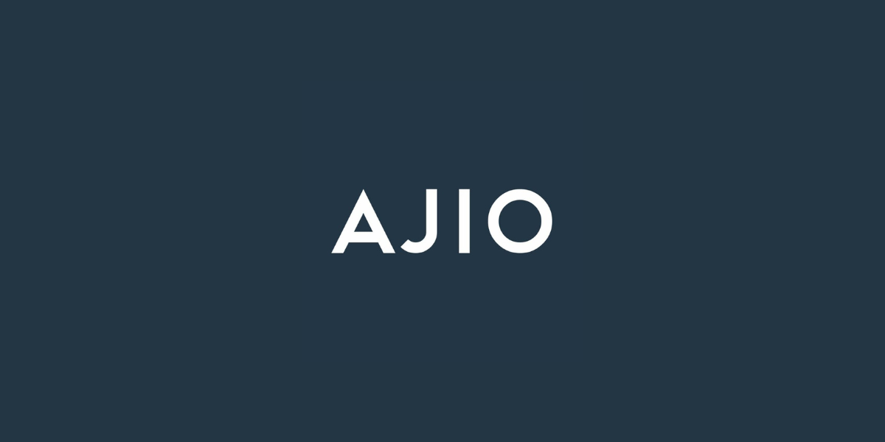
        

        

          
Case Study · Product Design

          <h3 class="proj-title">AJIO iOS — Redesigned</h3>
          
From back-tapping frustration to smart contextual navigation — a focused UX case study.

          

            2026
            <a href="#" class="proj-link">
              Case Study
              <svg width="12" height="12" viewBox="0 0 12 12" fill="none"><path d="M2 6h8M6 2l4 4-4 4" stroke="currentColor" stroke-width="1.4" stroke-linecap="round" stroke-linejoin="round"/></svg>
            </a>
          

        

      

      <!-- Card 3 -->
      

        

          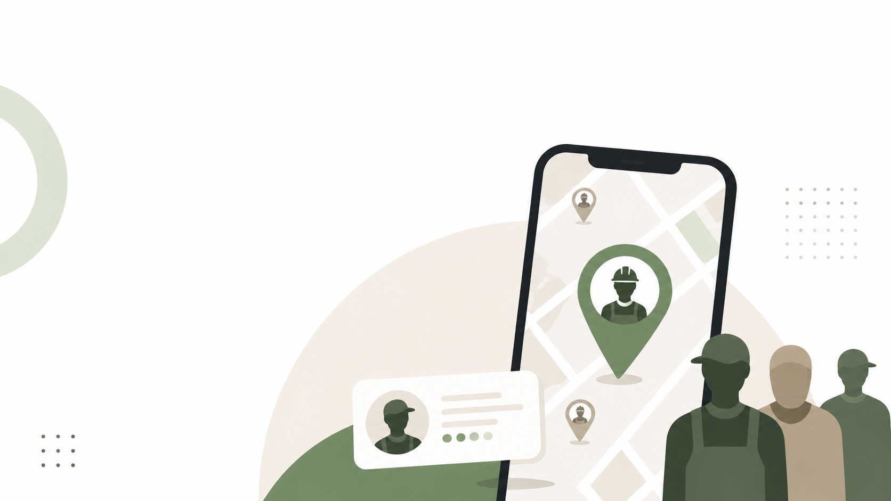
        

        

          
Visual Design · Systems

          <h3 class="proj-title">DailyHire — Designed</h3>
          
From street-corner hiring to smart local discovery — a UX case study for India's daily wage workforce.

          

            2026
            <a href="#" class="proj-link">
              Case Study
              <svg width="12" height="12" viewBox="0 0 12 12" fill="none"><path d="M2 6h8M6 2l4 4-4 4" stroke="currentColor" stroke-width="1.4" stroke-linecap="round" stroke-linejoin="round"/></svg>
            </a>
          

        

      

    

  

</section>

<!-- ABOUT -->
<section class="about" id="about">
  

    

      

        

          
A <em>Product Designer</em> who spent 6+ years as a System Admin — because every great experience starts with <em>understanding the system behind it.</em>

          

            6+ Years in Tech
            ITSM · L2 Support
            Coimbatore
            2024
          

        

      

      

        About
        <h2>From Systems to Stories.</h2>
        

        
I'm <strong>Vidhya</strong> — a Product Designer with a System Admin's brain. I spent 6+ years ensuring systems never missed a beat. Now I design experiences that ensure <strong>humans</strong> don't get left behind.

        — Vid
      

    

  

</section>

<!-- GALLERY -->
<section class="gallery" id="gallery">
  

    

      
<h2>Beyond the Screen — <em>Drawings &amp; Art</em></h2>
A quiet space for things made by hand. Sketches, illustrations, and visual experiments.

      
<button class="gfbtn active" data-filter="all">All</button><button class="gfbtn" data-filter="sketch">Sketches</button><button class="gfbtn" data-filter="digital">Digital</button><button class="gfbtn" data-filter="portrait">Portraits</button>

    

    

      
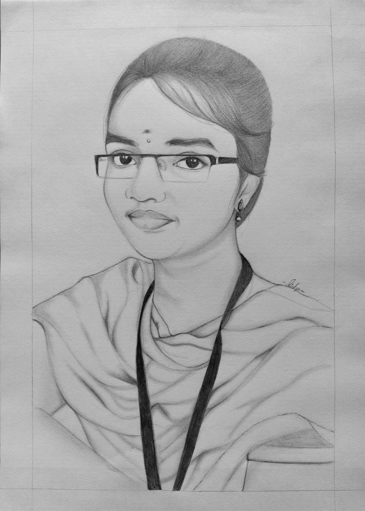
<h4>Portrait Sketch </h4>Pencil · 2023

🔍View

      
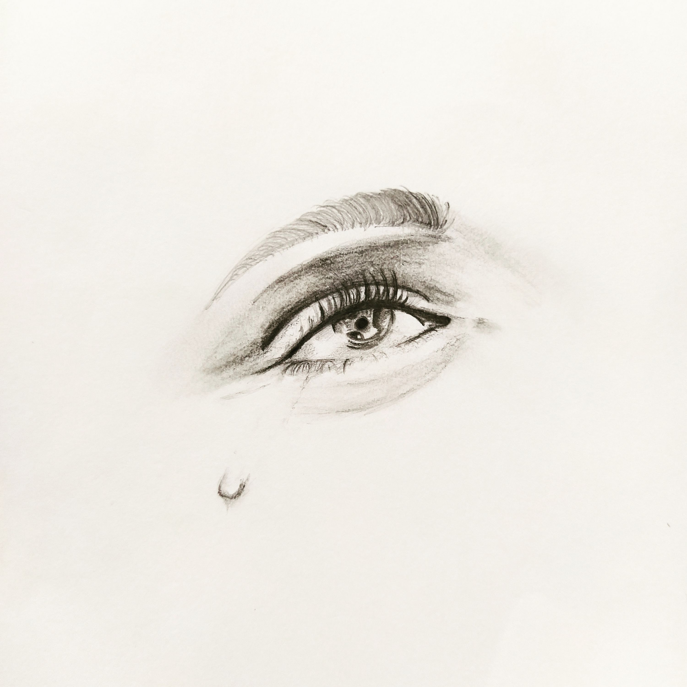
<h4>Emotions</h4>Pencil · 2023

🔍View

      
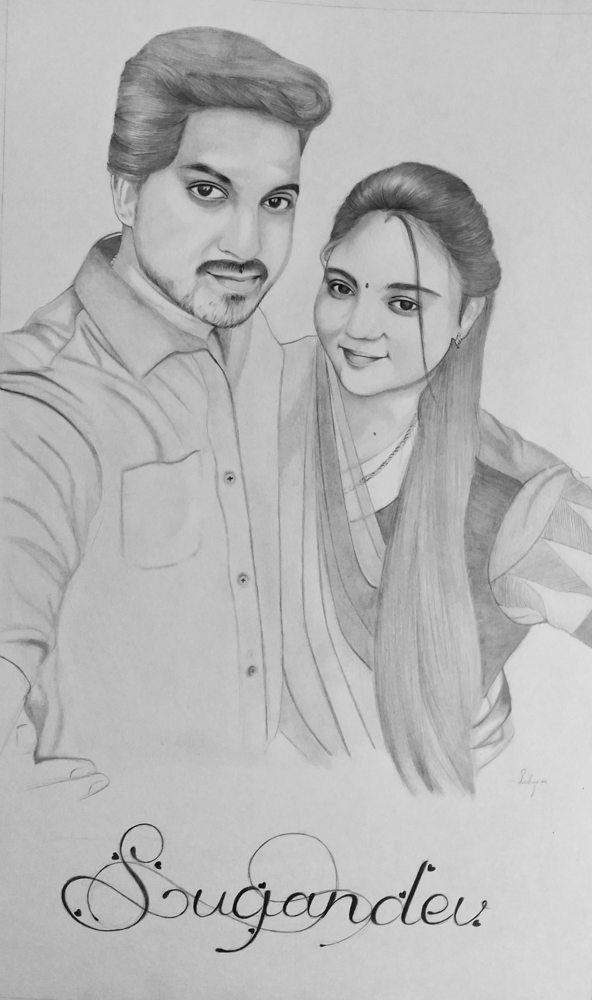
<h4>Couple Portrait</h4>Pencil · 2021

🔍View

      
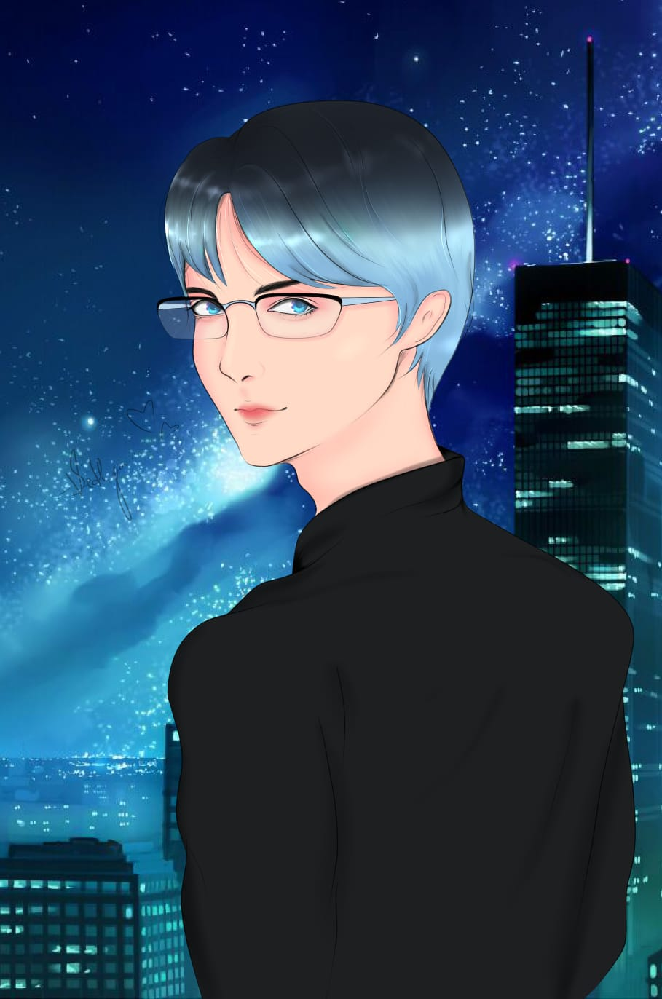
<h4>Digital Art</h4>Clip Studio · 2024

🔍View

      
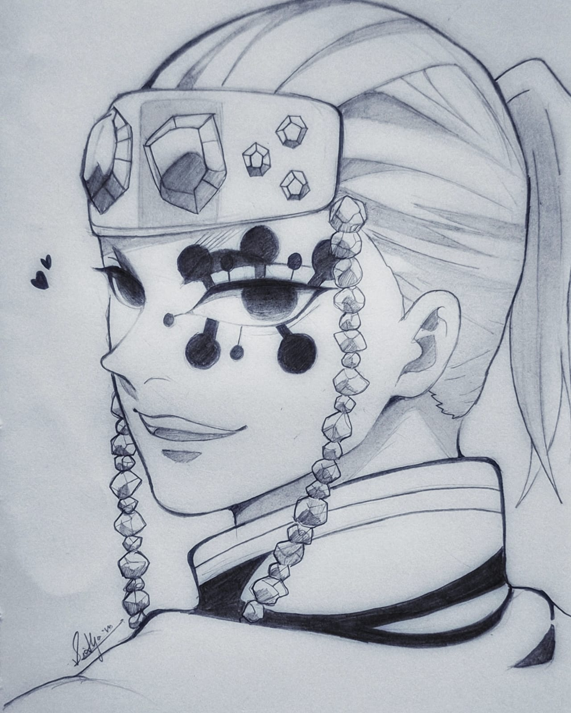
<h4>Demon Slayer</h4>Pencil · 2025

🔍View

      
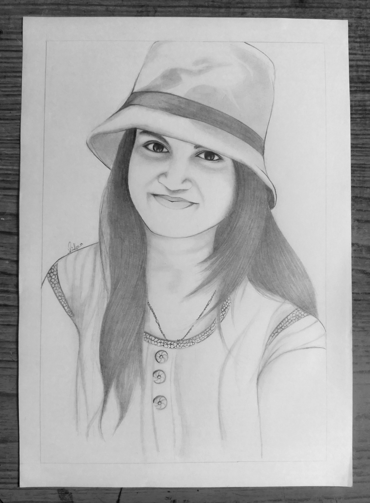
<h4>Commissioned Art</h4>Pencil · 2022

🔍View

      
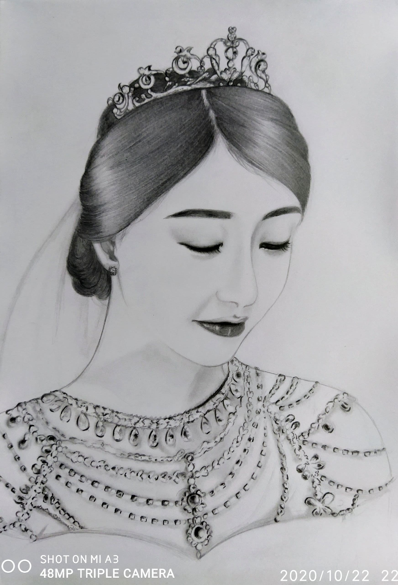
<h4>Korean Women Portrait</h4>Pencil · 2020

🔍View

      
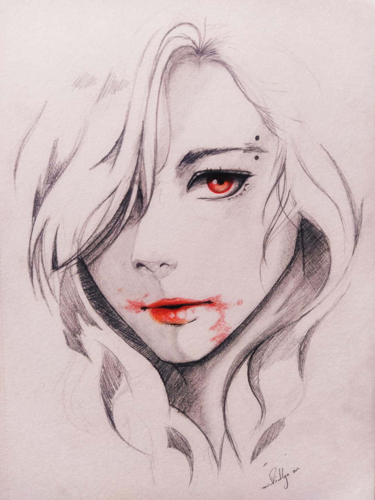
<h4>Vampire</h4>Pencil · 2024

🔍View

      
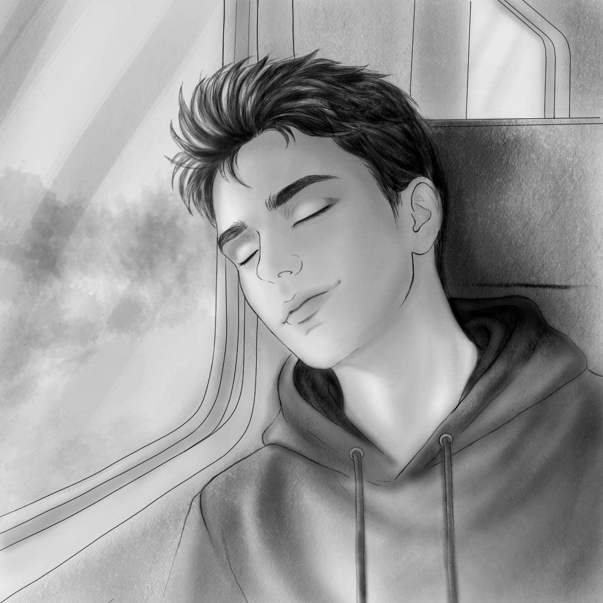
<h4>Evening Study</h4>Ink · 2026

🔍View

    

   <!-- 
Placeholder slots — replace each card with your actual drawings.
 --> 
  

</section>

  
<button class="lb-close" id="lbClose">✕</button>

<!-- FOOTER -->
<section class="footer-cta" id="contact">
  

    <h2 class="reveal">Let's design <em>something meaningful.</em></h2>
    
Open to full-time, contract &amp; freelance opportunities.

    
<a href="mailto:hello@vidhya.design" class="btn-rose">✉️ Get in Touch</a><a href="vidhya-resume.pdf" target="_blank" rel="noopener" class="btn-outline">View Resume ↗</a>

  

</section>
<footer class="footer-bar">© 2024 Vidhya. All rights reserved.Designed with ♥ and structured thinking</footer>

</body>
</html>
